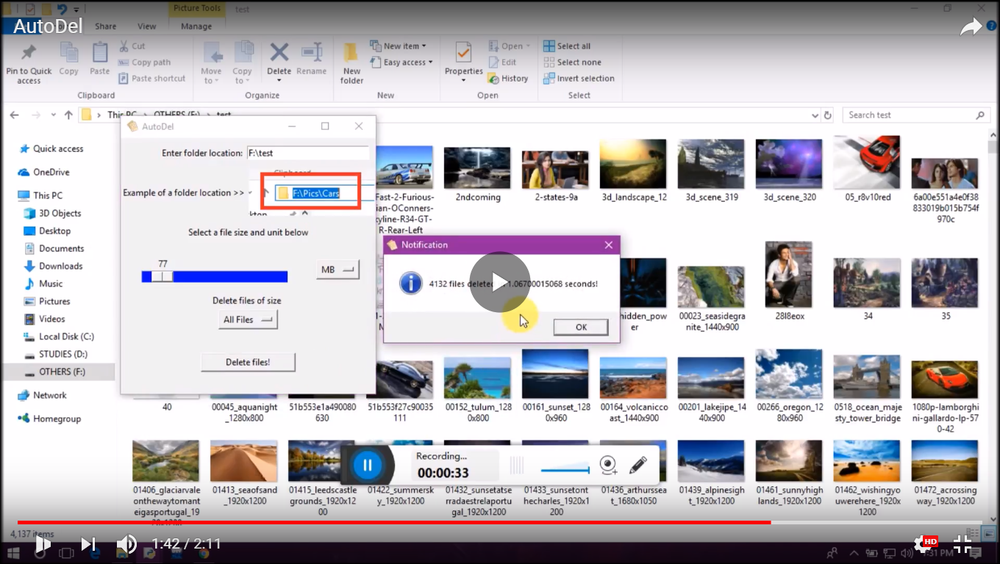
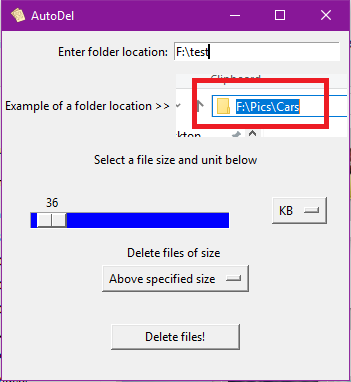

# AutoDel

<b>A desktop app for WINDOWS OS to delete thousands of files in the blink of an eye using `size parameter`<i>(except all the <u>`Read-only`</u> files)</b>

## <i>View the demo here</i>

## How to use
* clone the repository `https://github.com/ab-anand/AutoDel.git`
* `$ cd AutoDel`
* `$ pip install -r requirements.txt`
* `$ python app.py`

## Instructions

### Step 1
* Enter folder location in the format shown in the image. You can simply copy the folder location as shown in image.

### Step 2
* Select a file size and unit i.e., MB, KB, GB if you want a threshold value or simply select `All Files` to delete all files.

### Final step
* Press delete button, within a second you'll get a notification like shown below

## <b>To-Do List </b>

- [x] Add cut/copy/paste for filling location.
- [x] Add `ALL FILES` option in dropdown
- [x] Add time measure
- [ ] Add documentation link and report for bugs option in the status bar.
- [ ] Create an executable file
- [ ] Finally integrate the v2 ideas

<b><i>Note - currently new features are being integrated.</i></b>
